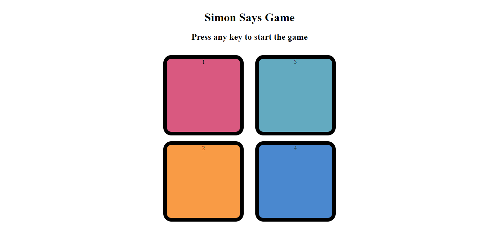

<h1>Simon Game Clone</h1>
<h2>Introduction</h2>

The Simon Game is a fun and interactive memory game that challenges players to remember and replicate a sequence of colors and sounds. The game progressively becomes more challenging as the sequence gets longer with each round.

<h2>Features</h2>
<ul>
  <li><b>Interactive Gameplay:</b> Users interact with the game by clicking colored buttons that light up and produce sounds.</li>
  <li><b>Increasing Difficulty:</b> The sequence gets longer and more challenging with each round.</li>
  <li><b>Score Tracking:</b> Keeps track of the player's progress and score.</li>
</ul>

<h2>Demo</h2>

Link to demo

<h2>Installation</h2>
Clone the repository:

bash
Copy code
git clone https://github.com/Its-Verma/simon_game.git
cd simon_game
Open the project:
Simply open the index.html file in your preferred web browser to view the project.

<h2>How to Play</h2>
<ul>
  <li>Start the Game: Press any key to start the game.</li>
  <li>Watch the Sequence: The game will show a sequence of colors. Pay attention and remember the order.</li>
  <li>Repeat the Sequence: Click the buttons in the same order as the sequence.</li>
  <li>Progress: If you replicate the sequence correctly, the game will add another color to the sequence. If you make a mistake, the game ends.</li>
  <li>Score: Your score is based on how many rounds you complete successfully.</li>
</ul>

<h3>Technologies Used</h3>
<ul>
  <li>HTML5: Markup language for structuring the web page.</li>
  <li>CSS3: Styling the web page to replicate simon's game look and feel.</li>
  <li>JavaScript: For game logic, interactivity, and handling user inputs.</li>
</ul>
Contributions are welcome! Please follow these steps to contribute:

<h2>Fork the repository.</h2>
Create a new branch (git checkout -b feature/your-feature-name).
Commit your changes (git commit -m 'Add some feature').
Push to the branch (git push origin feature/your-feature-name).
Open a Pull Request.
Please make sure your code follows the project's coding standards.

<h2>License</h2>
This project is licensed under the MIT License. See the LICENSE file for more details.

<h2>Acknowledgements</h2>
Simon game for the inspiration.
Font Awesome for icons used in the project.
<h2>Contact</h2>
If you have any questions, feel free to reach out:

Email: akash703315@gmail.com
GitHub: Its-Verma
